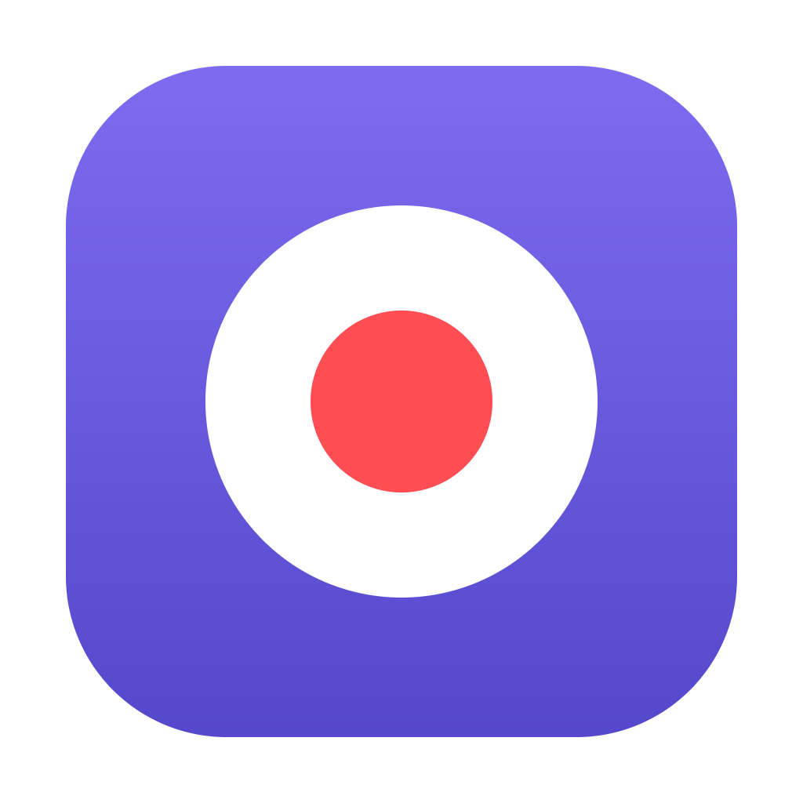
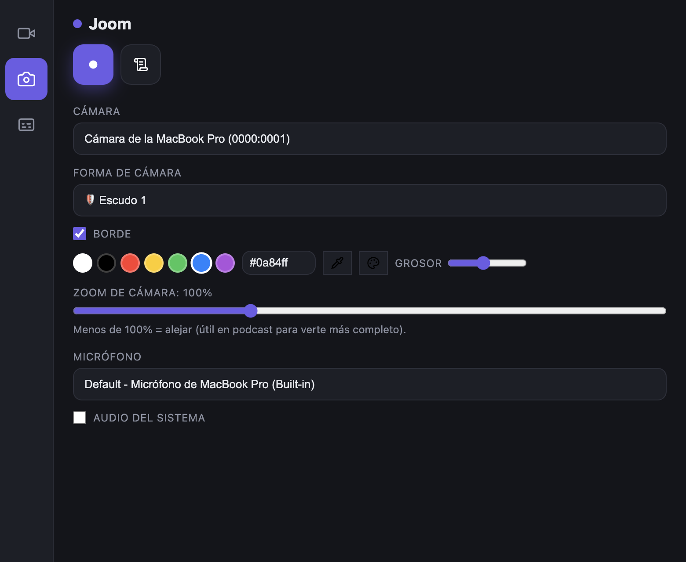
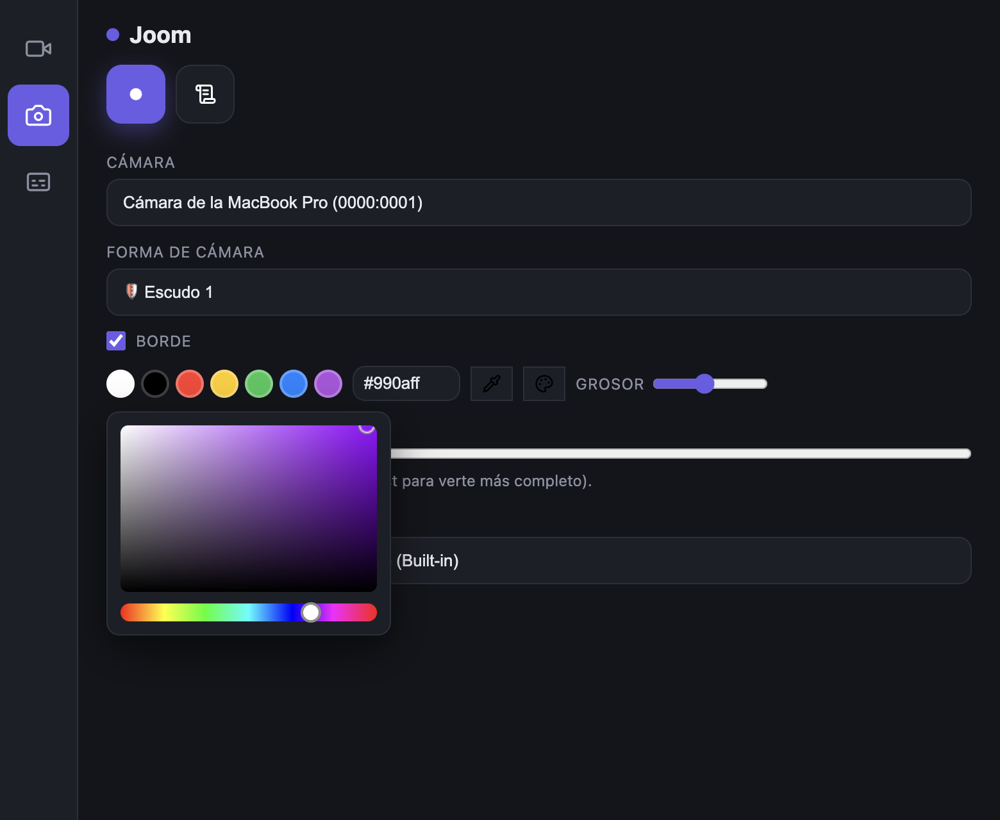
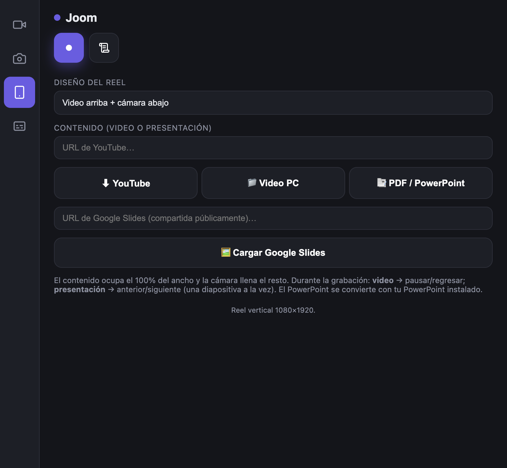
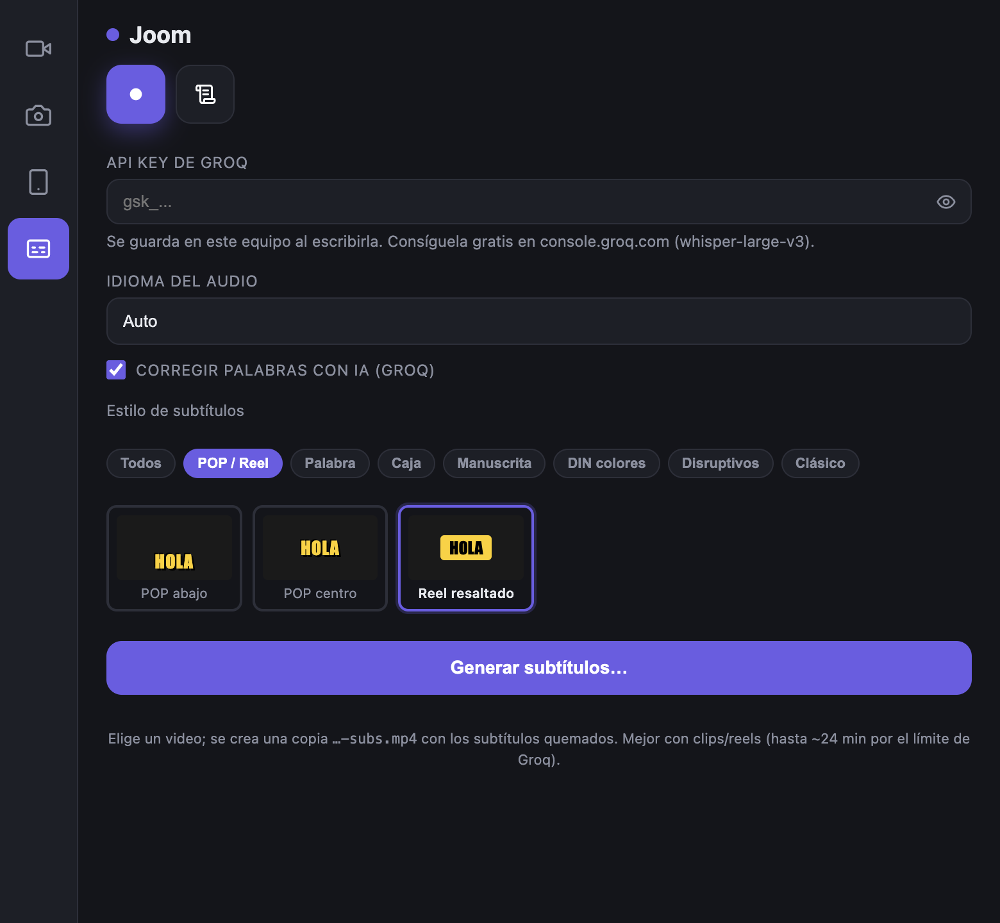
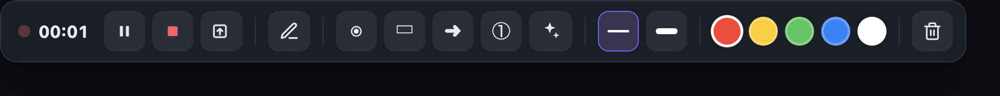
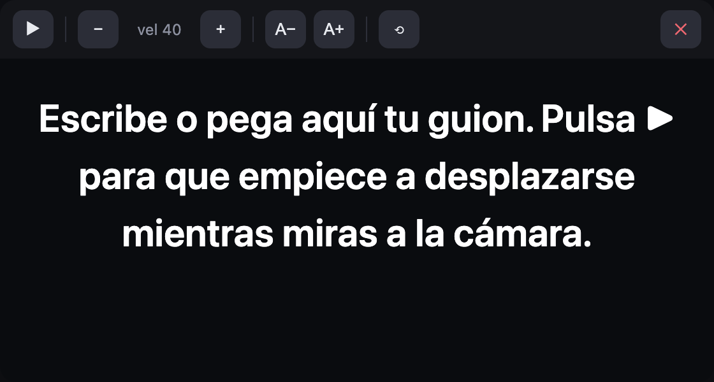

<p align="center">
  
</p>

<h1 align="center">Joom </h1>

Grabador de pantalla + webcam para **macOS**, mínimo y directo. Graba pantalla y
cámara compuestas en tiempo real, con formas de cámara, borde de color, barra de
anotaciones para presentar y modos reel/podcast.

Construido con **Electron**. La pantalla y la webcam se componen en un `<canvas>` y
se graban con `MediaRecorder` en **MP4 / H.264 por hardware (VideoToolbox)**, así la
grabación va siempre en tiempo real. Al detener, `ffmpeg` deja el MP4 listo para web.

## Capturas

| Cámara: forma + borde de color | Borde: mapa de color (HSV) |
|---|---|
|  |  |

| Modo reel (vídeo / presentación) | Subtítulos (estilos + IA) |
|---|---|
|  |  |

**Barra de anotaciones** mientras grabas — láser, rectángulo, flecha, **números**, **confeti**, colores y grosor:



**Teleprompter** flotante (guion desplazable con control de velocidad y tamaño):



---

## Instalación rápida

Necesitas **macOS 12+** (Apple Silicon o Intel) y **Node.js 18+**.

```bash
# 1) Clona el proyecto
git clone https://github.com/jairocarrizales/joom_mac.git
cd joom_mac

# 2) Instala dependencias (baja Electron + ffmpeg nativo de tu Mac)
npm install

# 3) (Opcional) para usar vídeos de YouTube en el reel
brew install yt-dlp

# 4) Arranca
npm start
```

> **¿No tienes Homebrew?** Instálalo con:
> `/bin/bash -c "$(curl -fsSL https://raw.githubusercontent.com/Homebrew/install/HEAD/install.sh)"`

La primera vez, macOS pedirá permiso de **Cámara** y **Micrófono**. Para grabar la
pantalla hay que concederlo a mano una vez:

> **Ajustes del Sistema → Privacidad y seguridad → Grabación de pantalla** → activa
> **Joom** (o **Electron** en desarrollo) y reinicia la app.

### Dependencias opcionales (solo si usas esas funciones)

| Función | Necesitas | Instalar |
|---|---|---|
| Reel con vídeo de **YouTube** | `yt-dlp` | `brew install yt-dlp` |
| Reel con **PowerPoint** (`.pptx`/`.ppt`) | LibreOffice (o Keynote) | `brew install --cask libreoffice` |

La grabación, la cámara, el reel con vídeo/PDF local y Google Slides funcionan sin
instalar nada extra. Joom detecta `yt-dlp` al vuelo (no hace falta reiniciar) y
avisa si falta.

---

## Funciones

### Modos de grabación
- **Pantalla completa** (horizontal) con la webcam como burbuja flotante.
- **Reel vertical** (9:16 → 1080×1920) con la cámara en banda, en burbuja o a
  pantalla completa, y un texto/banner opcional.
- **Pantalla + cámara vertical** (podcast): pantalla a la izquierda, cámara
  vertical a la derecha.

### Cámara
- **Formas:** Círculo, Vertical (móvil), Horizontal 16:9, **SuperElipse**, **Pebble**
  (orgánica), **Círculo difuminado** (niebla), **Escudo 1**, **Escudo 2**, **Arco**,
  **Esquina** (las 4 posiciones) o **sin cámara**.
- **Borde con color, activable o no:**
  - Paleta de colores rápidos.
  - Campo **hexadecimal** (`#ff3b30`, `#f33` o sin `#`).
  - **Cuentagotas** 🎨 que toma un color de cualquier parte de la pantalla.
  - **Mapa de color** (espectro HSV) navegable para elegir cualquier tono.
  - Control de **grosor** del borde.
- **Zoom** de la webcam y botón para traer la **cámara al frente**.

### Reel con medios
Carga contenido y navégalo durante la grabación:
- **Vídeo de YouTube** (descargado con `yt-dlp`).
- **Vídeo local** de tu Mac.
- **Presentación**: PDF, PowerPoint (→ PDF con LibreOffice/Keynote) o **Google Slides**.

### Barra de presentación (mientras grabas)
Puntero **láser**, **rectángulos**, **flechas**, **números** y **confeti** 🎉, con
color y grosor configurables.

### Teleprompter
Guion flotante y desplazable para leer mientras miras a la cámara, con control de
**velocidad** y **tamaño** de texto.

### Subtítulos automáticos
Genera subtítulos del audio con **Groq** (Whisper) y los **quema** en una copia
`…-subs.mp4`, con varios **estilos** (POP/Reel, Caja, Manuscrita, Clásico…) y
corrección opcional del texto con IA. Requiere una API key gratuita de Groq.

### Audio y calidad
- Selector de **calidad**: 720p / 1080p / 1080p60 / 1440p.
- **Micrófono** y **audio del sistema** (opcional).

---

## Atajos de teclado

| Atajo | Acción |
|---|---|
| `Ctrl+Shift+R` | Grabar / Detener |
| `Ctrl+Shift+P` | Pausar / Reanudar |
| `Ctrl+Shift+A` | Mostrar/ocultar anotaciones |
| `Ctrl+Shift+L` | Activar/desactivar láser |
| `Ctrl+Shift+C` | Confeti 🎉 |

---

## Salida

Al **Detener** se abre un diálogo para guardar el `.mp4` (por defecto en *Vídeos*).
Vídeo: H.264, `yuv420p`, `+faststart`. Audio: micrófono (+ sistema si lo activas).

## Compilar un instalador

```bash
npm run dist
```

Genera un `.dmg` y un `.zip` (arm64 + x64) en `dist/` con `electron-builder --mac`.

> Si la app no está firmada con tu cuenta, el primer arranque puede requerir
> clic derecho → **Abrir**, o ejecutar:
> `xattr -dr com.apple.quarantine "/Applications/Joom.app"`

## Arquitectura

| Ventana | Archivo | Rol |
|---|---|---|
| Panel de control | `renderer/control.*` | Modo, pantalla, cámara/forma/borde, mic, calidad, opciones de reel, grabar |
| Burbuja flotante | `renderer/overlay.*` | Webcam *always-on-top*; excluida de la captura con `setContentProtection` |
| Compositor (oculto) | `renderer/recorder.*` | Compone pantalla + webcam en canvas, graba con `MediaRecorder` |
| Barra de grabación | `renderer/recbar.*` | Pausa/detener + herramientas de anotación |
| Capa de anotaciones | `renderer/annotate.*` | Láser, formas, números y confeti sobre la pantalla |
| Selector de zona | `renderer/region.*` | Recuadro de pantalla a mostrar en el reel |
| Proceso principal | `main.js` | Ventanas, IPC, fuente de pantalla, ffmpeg, yt-dlp, conversión de presentaciones |

## Contacto

**Jairo Carrizales** — WhatsApp: [+52 826 158 2103](https://wa.me/528261582103)

## Licencia

**© 2026 Jairo Carrizales. Todos los derechos de autor quedan reservados.**

Software de **código visible** pero **no de código abierto** (Open Source) bajo
términos tradicionales.

- **Se permite:** uso personal, educativo, modificación privada y estudio del código.
- **Se prohíbe:** venta, distribución comercial, sublicenciamiento o monetización
  (directa o indirecta) del software, sus ejecutables o cualquier obra derivada por
  parte de terceros.
- **Usos comerciales:** WhatsApp [+52 826 158 2103](https://wa.me/528261582103).

Consulta el archivo [LICENSE](LICENSE) para los términos completos.
